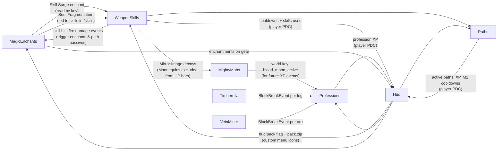

# Minecraft Server – Developer Docs

How the server is set up, what every plugin does, how the custom plugins are built,
and what to know before adding more. Companion file: [`ROADMAP.md`](ROADMAP.md) (ideas for what to build next).

*Last updated: 2026-10-06 (deployed ~21:38 UTC: MagicEnchants 1.9.0 – enchanting table focus (shift + right-click a table). ~21:21 UTC: MagicEnchants 1.8.0 – no exclusive enchantments (Mending + Infinity etc.), staffs at the enchanting table; Paths 2.6.0 – staff bolt auto-aim + 0.4 s cooldown; WeaponSkills 1.17.0; roots no longer launch mobs into the air. Before: deployed 23:43 UTC: MagicEnchants 1.7.0 – 21 more enchantments, 90 total, staffs enchantable; Paths 2.5.0 – third ability choices and a Spell slot for Pyromancer/Frost Warden; WeaponSkills 1.16.0, Hud 1.7.0, MightyMobs 1.10.0, Professions 1.8.0 hooks; pack 443 icons, all pixel art. MagicEnchants 1.6.0: 17 more enchantments, 69 total; MagicEnchants 1.5.0: 52 enchantments in categories, curses removed, pixel-art enchantment icons; WeaponSkills 1.14.0: Wind Arrow, sneak + 1-4 binds removed, back-loaded skill damage curve; Thorns of Frost/Frost Armor no longer freeze skill casters).*

---

## Contents

1. [Server at a glance](#1-server-at-a-glance)
2. [Folder layout](#2-folder-layout)
3. [Running the server](#3-running-the-server)
4. [Third-party plugins](#4-third-party-plugins)
   - [Datapacks](#4b-datapacks)
5. [Custom plugins](#5-custom-plugins)
   - [Shared foundation](#50-shared-foundation-since-2026-10-03)
   - [WeaponSkills](#51-weaponskills)
   - [Paths](#52-paths)
   - [Professions](#53-professions)
   - [MagicEnchants](#54-magicenchants)
   - [MightyMobs](#55-mightymobs)
   - [Hud](#56-hud)
   - [ItemCleaner](#56b-itemcleaner)
   - [How the plugins interact](#57-how-the-plugins-interact)
6. [Building & deploying](#6-building--deploying)
7. [Creating a new plugin](#7-creating-a-new-plugin)
   - [Language](#7b-language)
8. [Gotchas (learned the hard way)](#8-gotchas-learned-the-hard-way)
9. [Commands cheat sheet](#9-commands-cheat-sheet)
10. [Known issues & to-dos](#10-known-issues--to-dos)

---

## 1. Server at a glance

| | |
|---|---|
| Host | Ubuntu 24.04 VM on a Proxmox node – 2 vCPU, **6.6 GB RAM** (raised from 3.8 GB), ~31 GB disk (13 GB free), LAN IP `192.168.0.253` |
| Server software | **Paper 26.3** (build 140), Java 25, in Docker (`itzg/minecraft-server`) |
| Edition | Java Edition, online mode (real accounts only), max 20 players, difficulty **Normal** (set with `/difficulty normal` on 2026-10-01 – the world migrated from Pumpkin had kept Hard in its own data, which `server.properties` doesn't override) |
| World | `world` (seed `1792408271046144883`), migrated from Pumpkin on 2026-09-30. Game rule `players_sleeping_percentage 0` (2026-10-04): one sleeping player skips the night (saved in the world; game rules use snake_case names on 26.x) |
| Internet access | **playit.gg** tunnel (container `playit`) – players join via the playit address, no port forwarding (the network is double-NAT) |
| Operator | `qpRaresBaroSan` |

> **RAM:** the VM has 6.6 GB; Paper gets **4 GB** (`MEMORY: 4G` → `-Xms4G -Xmx4G`, raised from 2.5 GB
> on 2026-09-30). The container uses ~4.4 GB in total, leaving ~1.4 GB available on the VM – don't
> raise `MEMORY` further without giving the VM more RAM first.

---

## 2. Folder layout

```
~/pumpkin/                         (name is historical - the server started on Pumpkin)
├── docker-compose.yml             the live server: Paper + playit
├── .env                           PLAYIT_SECRET_KEY (keep private)
├── paper-data/                    everything Paper uses (mounted at /data in the container)
│   ├── world/                     the world (Paper 26.x layout: world/dimensions/minecraft/...)
│   ├── plugins/                   plugin jars + each plugin's config folder
│   ├── server.properties, bukkit.yml, spigot.yml, config/paper-*.yml
│   └── logs/
├── data/                          OLD Pumpkin server data (kept as a fallback, not used)
└── docker-compose.pumpkin.yml.bak OLD Pumpkin compose file

~/minecraft-plugins/               source code of our custom plugins (Java, Gradle)
├── weapon-skills/   paths/   professions/   magic-enchants/   mighty-mobs/   hud/   item-cleaner/
├── resource-pack/                 make_pack.py (+ ability_art.py, perk_art.py, skill_art.py, enchant_art.py pixel art) + build.sh -> build/pack.zip
│   └── (each plugin)  build.sh, build.gradle.kts, settings.gradle.kts, src/main/{java,resources}

~/pumpkin-plugins/                 OLD Rust/WebAssembly plugins for Pumpkin (not used on Paper)
~/backups/                         pumpkin-data-20260930-1021.tar.gz (the old Pumpkin world),
                                   plugins/ (previous jar of every custom plugin, for rollback),
                                   pack-<id>.zip (every older resource pack), *-config-*.yml / docker-compose.yml.bak-* (configs before edits)
~/Desktop/Minecraft-Server-Docs/   these docs + ROADMAP.md
```

Docker volumes used by builds (caches, safe to delete): `weaponskills-gradle`, `paths-gradle`,
`professions-gradle`, `magicenchants-gradle`, `mightymobs-gradle`, `hud-gradle`, and the old `pumpkin-cargo-*`.

---

## 3. Running the server

All commands from `~/pumpkin`.

| Task | Command |
|---|---|
| Status | `docker compose ps` |
| Start / stop | `docker compose up -d` / `docker compose stop` |
| Restart (after plugin changes) | `docker compose restart -t 60 minecraft` |
| Live log | `docker logs -f minecraft` (Ctrl+C to stop following) |
| Run a server command | `docker exec minecraft rcon-cli "<command>"` |
| Interactive console | `docker attach minecraft` – leave with **Ctrl+P then Ctrl+Q** (Ctrl+C stops the server!) |
| Who's online | `docker exec minecraft rcon-cli list` |

**Restart etiquette** (players are usually online):

```bash
docker exec minecraft rcon-cli 'say Server restarting in 30 seconds...'
sleep 30
docker exec minecraft rcon-cli 'save-all flush'
docker compose restart -t 60 minecraft
docker logs --since 2m minecraft | grep -iE 'Enabling|Done|ERROR|Exception'
```

**Paper jar is pinned locally:** `PAPER_CUSTOM_JAR: /data/paper-26.3-140.jar` in the compose file, so startup never calls PaperMC's API (on 2026-10-01 it returned 503 and the server crash-looped 17 times for 10 minutes). To update Paper: download the new build's jar into `paper-data/`, change the path, `docker compose up -d`. Modrinth plugins (`MODRINTH_PROJECTS`) are still checked online at every start.

**Changing server settings:** most `server.properties` values are driven by environment variables
in `docker-compose.yml` (`DIFFICULTY`, `MAX_PLAYERS`, `VIEW_DISTANCE`, `MEMORY`, ...). Edit the
compose file, then `docker compose up -d` (recreates the container).

**Backups:** there is **no automatic backup yet**. Options: Proxmox VM snapshots/backups, or add
the `itzg/mc-backup` container to the compose file.

---

## 4. Third-party plugins

| Plugin | Version | Installed via | Purpose |
|---|---|---|---|
| **EssentialsX** + **EssentialsXSpawn** | 2.22.1 dev build #1830 | `PLUGINS:` URLs in compose | Homes, warps, `/tpa`, `/spawn`, `/back`, kits, economy... |
| **VeinMiner** (MiraculixxT) | 2.12.2 (2.12.3 available) | `MODRINTH_PROJECTS:` in compose | Sneak-mine a whole ore vein |
| **Timberella** | 2.0.0 | `MODRINTH_PROJECTS:` in compose | Fell whole trees, replant, leaf decay |
| spark | bundled with Paper | – | Profiler (`/spark`) |

- **To update/add** a Modrinth plugin: change or add a line under `MODRINTH_PROJECTS` (`slug:version`), then `docker compose up -d`. The image downloads it on start. Check the plugin has a **Paper 26.3** build first (Modrinth search with the `26.3` + `paper` filters).
- **EssentialsX:** the newest stable release is 2.22.0 (May 2026, before 26.3), so dev build #1830 is pinned. Switch to a stable URL once a release supports 26.3.
- **EssentialsX settings changed:** `use-bukkit-permissions: false` in `plugins/Essentials/config.yml`, so normal players get the commands in `player-commands` (homes, tpa, warp, spawn, back...). There is no permissions plugin (no LuckPerms). If one is added later, switch that setting back.
- **VeinMiner:** `mustSneak: true` (vein mining only while sneaking). **Timberella:** `sneak_mode: 1` (fells trees when *not* sneaking).
- `spigot.yml`: `log-named-deaths: false` (MightyMobs names every mob, which would spam the console).

### 4b. Datapacks

| Datapack | Version | Purpose |
|---|---|---|
| **Terralith** (Stardust Labs) | 2.6.5+26.3 | Overworld terrain/biome overhaul (~95 biomes, `terralith:*`) – vanilla blocks only |
| **Dungeons and Taverns** (nova_wostra) | 6.0.2 | New vanilla-style structures (taverns, dungeons, towers…) and reworked vanilla ones |

- Installed 2026-10-03 as zips in `paper-data/world/datapacks/` (downloaded from Modrinth, SHA-1 checked; the D&T file was renamed to remove spaces). Paper loads new files there automatically at startup – check with `/datapack list enabled`.
- **Only newly generated chunks** use them. The world existed before (vanilla terrain from Pumpkin), so there are hard seams where old land meets new, and the new structures only appear in unexplored areas.
- **Updating:** download the new version for the server's Minecraft version (both are tied to one data format, 121 = 26.3), replace the zip, restart. Before updating Paper to a new Minecraft version, check both packs have a matching release first.
- **Don't remove Terralith** once players have explored with it – chunks store `terralith:*` biomes. To undo, restore the backup instead.
- **Rollback backup:** `~/backups/pre-datapacks-20261003/` (`world.tar.gz` = world just before both packs, `docker-compose.yml`, `RESTORE.md` with the steps).
- Interplay with our plugins: worldgen uses vanilla blocks/mobs, so Professions finds, Clear Cut's natural-leaf check and MightyMobs spawns work as usual; D&T loot chests that roll random enchantments can roll MagicEnchants ones (`on_random_loot`). Terralith makes new-chunk generation heavier on the 2 vCPUs.

---

## 5. Custom plugins

All seven are written in **Java 25** against **Paper API `26.3.build.140-beta`**, built with Gradle in
Docker (see [§6](#6-building--deploying)). Player data is stored in each player's
**PersistentDataContainer (PDC)**, so it survives restarts and moves with the player file – no databases.

### 5.0 Shared foundation (since 2026-10-03)

The plugins are built so other survival servers can use them (see `~/minecraft-plugins/README.md` and the
README in every plugin folder). Shared code lives once in **`~/minecraft-plugins/common/src/`** and is copied
into every plugin as `com.raresb.<plugin>.common` by **`sh common/sync.sh`** (each jar stays standalone):

| Class | What it does |
|---|---|
| `Lang` | Player text from `plugins/<Plugin>/lang/<language>.yml` (MiniMessage). `lang.get(key, "name", value, ...)`, `item()`/`lore()` (no italics, for menus), `count(key, n)` (plural forms: `one`/`few`/`other`, Romanian rules for `ro`), `raw()`/`rawList()`. Falls back to the jar's file of that language, then English. |
| `ConfigFiles` | On start, adds keys missing from `config.yml` / `lang/*.yml` (with comments) – never changes existing values, and skips keys under an old-format value (e.g. MightyMobs' `worlds: []` list). |
| `ConfigCommand` | `reload`, `config get/set/reset/list`, `toggle <feature>`, `lang <code>` for every plugin (type-checked, saved, applied). |
| `Worlds` | `worlds: {mode: blacklist\|whitelist, list: []}` (a plain list = whitelist, the old MightyMobs format). |
| `Perms` | Registers per-feature nodes with `default: true` (`paths.path.<id>`, `professions.profession.<id>`, `weaponskills.weapon.<id>`, `weaponskills.skill.<id>` + `.*`). Undeclared nodes would default to op-only. |
| `Integrations` | Logs at startup which companion plugins were found. |
| `Root` (2026-10-06) | `Root.apply(plugin, target, ticks, slowness)`: Slowness + no jumping (transient `<plugin>:root` JUMP_STRENGTH ×0 modifier, removed when the longest running root ends). Use it for every root/pin/snare – **never Jump Boost 200** (see §8). |

- **Enum descriptions** (skills, evolutions, abilities, talents, perks, professions, augments, combo marks) are
  looked up through a static `<Plugin>.text(key, fallback)`; the Romanian text still in the enums is only the
  fallback. Edit the **lang files**, not the enums, to change wording.
- **Our server runs `language: ro`** in every plugin's `config.yml`. New installs default to `en`.
- New toggles: `paths.<id>.enabled`/`xp-multiplier`, `talents.<id>`, `max-active-paths`, `combat-lock-seconds`
  (Paths); `professions.<id>.enabled`/`xp-multiplier`/`find-multiplier`, `messages.*` (Professions);
  `weapons.<id>.enabled`, `skills.<id>.enabled`, `combos.enabled`, `augments.enabled` (WeaponSkills);
  `enchantments.<id>.*` (MagicEnchants – new config, read by the bootstrapper); `ignored-mobs`,
  `health-display.enabled/all-worlds`, `blood-moon.worlds` (MightyMobs); `sidebar.sections.*`,
  `sidebar/damage-numbers.enabled` (Hud); `messages.*` (ItemCleaner).
- Gating: Paths' `active()` and Professions' `level()` return only what works for the player *right now*
  (enabled, permitted, allowed world); `storedActive()` / `storedLevel()` give the saved values (menus, admin).

### 5.1 WeaponSkills

*Special attacks for weapons, a skills menu, progression, evolutions, loadouts, and the guide book.*

**How it's used:** hold a weapon and press **F** (swap-hands key). What the player is doing picks
the *trigger slot*: standing, mid-air, sprinting, sneaking, looking up, looking down,
sneaking + looking up (ultimate); shields: blocking, blocking + sneaking. Hoes, shovels and fishing rods have one
skill each on plain F (so F no longer swaps them to the off hand).

**Woodcutting** is not an item: an axe counts as the Woodcutting "weapon" while the player looks at a log or
leaves or a sapling within 6 blocks (`WeaponSkillsPlugin.heldWeapon`), so the axe's combat loadout is untouched.
The three woodcutting skills are made to work *with* Timberella: **Clear Cut** fells every natural tree in a 10×10 area
(evolved 16×16) and replants saplings on the trunk spots; **Grove Growth** grows every sapling within 8 (12) blocks with
bone meal until it becomes a tree; **Lumber Frenzy** gives 20 s (30 s) of Haste II and +1 (+2) log per log broken
(`BlockDropItemEvent`, so it also works on Clear Cut). They replaced Timber Sense and Leaf Storm in 1.9.1.

| | |
|---|---|
| Source | `~/minecraft-plugins/weapon-skills` – version **1.17.0** |
| Weapons | Sword, Axe, Shield, Bow, Crossbow, Trident, Mace, Pickaxe, Woodcutting, Hoe, Shovel, Fishing Rod, **Spear** – **85 skills** in `Skill.java` |
| Commands | `/skills` (menu), `/guide` (book), `/skills admin setlevel <player> <skill\|weapon\|all> <level>`, `/skills admin reset <player>`, `/skills admin reload`, `/weaponskills-reload` |
| Permissions | `weaponskills.use` (everyone), `weaponskills.admin` (op) |
| Config | `plugins/WeaponSkills/config.yml` – per-skill `cooldown`/`damage`, `hit-passive-mobs`, `durability-cost`/`durability-chance`, `progression` (`max-level: 50`, `bonus-cap-level: 20`, xp, damage/cooldown per level, `evolve-level: 10`), `dodge.*`, `attack-speed.*` |

**Systems:**
- **Levels** 1–50 per skill (XP per use + per enemy hit). Damage follows the damage curve below up to level 50; each level up to `progression.bonus-cap-level` (20) also gives −1.5% cooldown (`Progress.bonusLevel()` is what cooldowns and effect lengths scale with).
- **Dodge roll** (`Dodge.java`, config `dodge.*`): double-tap sneak on the ground while holding a combat weapon (not a tool – `Weapon.isTool()`) or a shield. Rolls where the movement keys point (backwards if none); invulnerability frames for 10 ticks (`dodge.untouchable-ticks`) – all damage is cancelled except void, `/kill`, starvation and the world border, and harmful effects from attacks, arrows and thrown/lingering potions are blocked too; 3 s cooldown, shown in the Hud sidebar as "Eschivă".
- **Evolutions** at skill level 10 – every skill gains a new effect (texts in `Evolutions.java`, code checks `skills.evolved(player, skill)`).
- **Attack speed from mastery** (`attack-speed.*`): holding a sword or axe gives +0.2% attack speed per mastery point of that weapon, up to +30% (150 mastery) – a proportionally shorter cooldown between full-strength hits. Transient `ATTACK_SPEED` modifier `weaponskills:mastery_attack_speed`, updated every second and on item switch; shown on the weapon's `/skills` page.
- **Mastery** = sum of (level − 1) over a weapon's skills. Unlocks extra skills: sword/axe at 5/10/15/20/30/40, bow 5/10/15/20, crossbow 5/10/15, trident and mace 5/10, shield 2/4/6/8/10; spear 5/10/15/20; ultimates at 25 for sword, axe, bow, crossbow, trident, mace and spear.
- **Loadout:** any unlocked skill can be put in any fitting slot via `/skills` (aerial skills only in the mid-air slot, ultimates only in the ultimate slot).
- **Aiming (`Aim.java`, 1.10.0):** the look-up, look-down and ultimate keys are pressed while looking steeply up/down, so a skill cast with one of them aims **straight ahead**: `Aim.direction()` for shots and throws, `Aim.lookedAt()` for lock-on skills, `Aim.groundSpot()` for area skills (rains, barrages, leaps – the spot is always on the ground: aiming at a wall/ceiling/the sky uses the ground under that point; a look-key cast picks the nearest enemy in front or the ground ≤ 8 blocks ahead). Skills where looking up/down *is* the point opt out in `Skill.freeAim()` (Riptide Surge, Grapple Hook, Tunnel Bore, Shatter, Harvest Wave, Wind Burst). `Aim.flat()` is the horizontal facing from yaw – use it instead of `getDirection().setY(0).normalize()`, which is NaN at ±90° pitch. Before 1.10.0, Tomahawk Rain/Arrow Rain/Rain of Fire/Artillery Barrage landed in the sky (or on top of the cave ceiling) when cast looking up.
- **Spear (1.10.0, `SpearSkills.java`):** 7 slots like the sword. Defaults: Impale (F, piercing 6-block thrust, pins the first target), Dragoon Dive (air), Lance Charge (sprint), Javelin (sneak, piercing throw), Pole Vault (look up, mobility), Sweeping Arc (look down, 360° sweep). Unlocks: Spear Wall 5, Thrust Flurry 10, Pinning Throw 15, Dragon Leap 20; ultimate **Gungnir** 25 (giant spear falls where you aim + rings of light spikes). No item cooldown sweep on spears (right-click is their charge attack). Balance numbers are first guesses.
- **Sneak + 1-4 binds: removed in 1.14.0** (added in 1.11.0). Sneaking + a number key changed the selected hotbar slot for players, so the four `KEY_1..KEY_4` slots, `castWithKey()`, the `/skills` row and `shift-keys.enabled` are gone; sneak + 1-4 is vanilla again. Old `weaponskills:slot_<weapon>_key_<n>` PDC entries are simply ignored.
- **1.16.0 (MagicEnchants hooks):** a dodge roll writes `weaponskills:dodged_at` (long ms) in the player PDC – MagicEnchants **Afterimage** reads it; **Resonance** on the held weapon multiplies every augment number by 1 + 0.15/level (`Augments.resonance()`: Brutal/Swift/Execute strength, on-hit effect lengths, Vampiric, Mending, Echo chance, Reaping).
- **Knockback resistance (1.15.0):** `Combat.knockBack` now scales skill knockback by `1 − KNOCKBACK_RESISTANCE`, like vanilla knockback – netherite armor (0.1 per piece) and Steadfast now soften skill knockback too (and the Wind Arrow self-launch).
- **Wind Arrow (1.14.0)** replaced Grapple Arrow as the bow's look-up skill (`RangedSkills.windArrow` / `windBurst`): a skill arrow that bursts where it lands, knocking enemies within 3.5 blocks back and up; a shooter inside the burst is thrown too and protected from fall damage. Evolved: 5-block burst, stronger, and enemies caught take 40% of the arrow's damage. Default damage 4.0 (flat, bow). Players' Grapple Arrow XP moves to Wind Arrow on their first load (`Progress.migrate`), so bow mastery is unchanged; its augment picks are dropped.
- **Damage curve (1.14.0, config `progression.damage-*`):** skill damage grows over **every level up to 50**, back-loaded: `damage-at-level-1` (×0.6) → `damage-at-max-level` (×1.95) along `((level−1)/49)^damage-curve` (1.5) – ×0.71 at 10, ×0.93 at 20, ×1.21 at 30, ×1.59 at 40, ×1.95 at 50 (`Progress.damageMultiplier`). Before 1.14.0 it was +5%/level capped at 20 (×1.95 at 20), which let mid-level players kill enchanted-diamond players in 2–3 skills; now that strength takes a level-50 skill. Same for mobs and players (a PvP-only ×0.5 was tried and dropped before release). Cooldown reduction and effect length still use `bonus-cap-level` (20).
- **Real numbers in `/skills` tooltips (1.11.0):** damage in hearts per hit when holding that weapon type (flat-damage weapons always), otherwise the ×multiplier; level + augment bonus %; cooldown in seconds; augment status per tier.
- **Augments (1.11.0, `Augment.java` + `Augments.java`):** at skill level 30, 40 and 50 the player picks 1 of 2 augments (right-click a skill in `/skills` → augment page; free to change). 14 types – Brutal, Swift, Execute, Searing, Frost, Venom, Sunder, Vampiric, Reaping, Echo, Guarded, Fleet, Mending, Vigor – applied through shared hooks: `Skills.damage()`, `effectiveCooldown()`, `Combat.hit()` (`modifyHit`/`afterHit`), `cast()` (`afterUse`, Echo), and a death listener (Reaping). `Augment.options(skill, tier)` decides the pair: damage skills get Brutal/Swift → a weapon-themed on-hit pair → Reaping/Echo; utility skills get Swift/Echo → Guarded/Fleet → Mending/Vigor. PDC `weaponskills:aug_<skill>_<tier>`. Icons `raresb:augment/<id>`.
- **Cross-weapon combos (1.11.0, `Combos.java`):** a skill hit from a combat weapon marks the target for 4 s (sword Exposed, axe Sundered, shield Staggered, bow Marked, crossbow Bolted, trident Soaked, mace Dazed, spear Pinned; small coloured puff over marked mobs). A skill hit from a *different* weapon by the same player consumes the mark and triggers its combo (bonus damage, stun, armor shred, lightning, small blast…). Combo damage is a plain `damage()` call inside the `raresb_no_chain` tag, so it never chains. Tools leave no marks. Shown on each weapon page header.
- **Data cache (1.11.1):** `Progress` keeps each online player's skill XP and levels in memory (write-through: every change also goes to the PDC, so Hud etc. still read current values), `Augments` their picks and `Loadout` their slot choices; all dropped on quit, levels re-computed after a config reload. Paths (2.2.0) and Professions (1.4.1) do the same through their own `DataCache` (active paths, picked abilities/talents/perks, XP). **Any new code that changes these values must go through these classes**, not write the PDC directly, or the cache goes stale until the player relogs.
- **Crash guard (1.9.2):** `onSwapHands` wraps `skills.use()` in `try/catch (Throwable)` – a failing skill is logged (skill, player, location, held item, full trace), put on cooldown and the player sees "… a dat greș." instead of the server crashing (see the 2026-10-01 crash in §8).
- **Cooldown UI:** action bar line above the hotbar + the item cooldown sweep (only on swords, axes, maces, pickaxes – see gotchas).

**Code map:**

| File | What's in it |
|---|---|
| `Skill.java` | Every skill (name, icon, weapon, default slot, kind, unlock, icon item, default cooldown/damage, description), `Weapon` and `Trigger` enums |
| `WeaponSkillsPlugin.java` | Main class: F-key trigger detection, cooldowns, action-bar cooldown line, Parry/Reflect hooks, Skill Surge, commands |
| `Skills.java` | Dispatcher `use()`, damage formula, evolutions check, core sword/axe/shield skills |
| `ExtraSkills.java` | Unlockable sword/axe/shield skills + ultimates (Judgment, Ragnarok) |
| `RangedSkills.java` | Bow & crossbow skills (arrow cost, skill arrows tagged in PDC) |
| `OtherSkills.java` | Trident and mace skills, Tremor Sense |
| `SpearSkills.java` | Spear skills (1.10.0) |
| `Aim.java` | Where skills aim – look-key casts aim straight ahead, ground spots, lock-on targets |
| `MoreSkills.java` | Later sword/axe/trident/mace/shield skills (Crescent Wave … Cataclysm, Shield Throw, Phalanx) and tool skills (Harvest Wave, Burrow, Grapple Hook); also a listener (Counter Stance, Lumberjack's Fury, Burrow) |
| `PackModels.java` | Which `raresb:` icons the current `plugins/Hud/pack.zip` really contains – menus only use those (same class in Paths and Professions) |
| `GatherSkills.java` | Mining skills (Tunnel Bore, Miner's Rush, Shatter) and woodcutting skills (Clear Cut, Grove Growth, Lumber Frenzy – also a listener); `breakOverTime()` breaks blocks a few per tick with `player.breakBlock` |
| `Combat.java` | Targeting (`canHit`, `around`, `inFront`), `hit()` (damage + hit XP), knockback, server-side ground check, fall protection, durability |
| `Progress.java` / `Loadout.java` | XP & levels / slot assignments & unlocks |
| `SkillMenu.java` / `Guide.java` / `Evolutions.java` / `Fx.java` | Menu UI / `/guide` book / evolution texts / particle helpers |

**PDC keys (players):** `weaponskills:xp_<skill>` (int), `weaponskills:slot_<weapon>_<trigger>` (string),
`weaponskills:skills_used` (int, counter for `/stats`), `weaponskills:held` (string `Sword|12`: held weapon and its mastery, for the Hud sidebar), `weaponskills:cooldowns` (string `Name=readyAtMillis;...`, running cooldowns for the Hud sidebar; removed on quit).
Temporary attribute modifiers use keys `weaponskills:boost_*` (removed on join if a restart interrupted them).

**Gathering skills:** blocks are broken with `player.breakBlock`, so they drop, cost tool durability and fire
`BlockBreakEvent` (Professions XP, Timberella, enchantments all react). Mining skills skip containers/spawners and
anything the pickaxe isn't the right tool for. Clear Cut only takes log clusters that touch naturally grown
(non-persistent) leaves, so log houses and fences are safe; replanting only happens where the trunk stood on soil
(dirt-type blocks, or nylium for nether fungi). Harvest Wave also uses `player.breakBlock` (Farming XP counts) and
replants for free.

**To add a skill:** add an entry in `Skill.java` → implement a method (in the right `*Skills.java`) → add a
`case` in `Skills.use()` → add an evolution text in `Evolutions.java` → add it to `config.yml` (optional,
defaults come from the enum). Use `combat.hit(player, target, damage, Skill.X)` so it earns XP.

### 5.2 Paths

*Pick two of 11 combat paths. In each path the player chooses one of two abilities for every slot
(on-hit passive, always-on passive, M2 skill) and one of two talents at levels 5, 10, 15 and 20.*

| | |
|---|---|
| Source | `~/minecraft-plugins/paths` – version **2.6.0** |
| Paths | `Path.java`: **Lancer** (spear, 2.1.0), **Duelist** (sword), **Warbringer** (axe), **Ranger** (bow), **Arbalist** (crossbow), **Tidecaller** (trident), **Juggernaut** (mace), **Sentinel** (shield), **Shadow** (sword), **Beastmaster** (pets / bone), **Pyromancer** (Blaze Rod staff), **Frost Warden** (Breeze Rod staff) |
| Abilities | `Ability.java` – 82 (2 per slot × 3 slots × 12 paths, plus a 3rd choice per slot and 2 spells for Pyromancer and Frost Warden); the first of each slot is the default |
| Commands | `/paths` (menu), `/paths admin setlevel <player> <path\|all> <level>`, `/paths admin resetcooldown <player>` (also resets M2 cooldowns), `/paths admin reload` |
| Permissions | `paths.use` (everyone), `paths.admin` (op) |
| Config | `plugins/Paths/config.yml` – `max-level: 50`, `bonus-cap-level: 20`, xp curve, `switch-cooldown-minutes: 60` |

- **Menu** (`PathMenu.java`): main page lists all paths; each path has its own page with the on/off button, the
  three slot rows (two choices each, with their level upgrades) and the talent grid (tier 5/10/15/20, choice A on
  top, B below). Abilities and talents can be changed any time **outside combat** (10 s after dealing or taking damage).
- Two active paths can't use the same weapon (Duelist + Shadow are both swords). Dropping a path starts the 1-hour
  switch cooldown; filling an empty slot is free. Only active paths earn XP; progress is kept for all paths.
- **Upgrades:** each ability has built-in improvements at certain levels (`"Lvl 10: ..."` lines in `Ability.java`;
  `Ability.upgradeLevel()` parses them). The four original paths keep their old milestone behaviour inside their default abilities.
- **Talents** (`Path.Talent`, picked per tier): 5 = Lovituri puternice (on-hit +30%) / Sete de sânge (5% lifesteal);
  10 = Abilitate amplificată (M2 +30%) / Reîncărcare rapidă (M2 −25% cooldown); 15 = Pasivă întărită (always-on +30%)
  / Pas ușor (+10% speed, agile paths) or Piele groasă (−10% damage taken, sturdy paths); 20 = Forța path-ului (+10%
  damage) / Vânătoare (kills halve the M2 cooldown). Strength multipliers: `PathsPlugin.hitPower/passivePower/skillPower`.
- **Which path a hit counts for** (`PathEffects.source()` / `paths()`): melee by held weapon, arrows by the `paths:weapon`
  tag (bow/crossbow), thrown tridents, tamed pets (→ owner's Beastmaster), magic bolts (`paths:bolt` tag). Melee hits while
  carrying a shield also count for Sentinel. A bow swung in melee doesn't count for Ranger (`fits()`).
- **M2 triggers:** sword, axe (not on strippable blocks), mace, bone, staffs = right-click (staffs: sneak + right-click = Spell); trident = sneak + right-click;
  shield (either hand) = sneak + right-click; bow = sneak + full draw; crossbow = sneak + shoot.
- **Magic paths 2.5.0:** Pyromancer and Frost Warden get a **third choice in every slot** and a 4th slot, **Spell** (`Path.Slot.SPELL`, cast with **sneak + right-click** with the staff; plain right-click stays the M2). `Path.slots()` lists only the slots a path has – use it instead of `Slot.values()`. Spells have their own cooldown map (`PathEffects.spellReadyAt`), shown in the Hud sidebar with the M2s; Skill Haste/Focus talents and Battle Focus shorten both. Menu: two slots per row (label + up to 3 choices): on-hit | always-on, M2 | spell (`PathMenu.SLOT_ROWS`).
  - Pyromancer: Cinder Chain (on-hit: a bolt on a burning target jumps 50% to 1 more enemy, Lvl 10: 2), Kindled Soul (passive: staff kills give Heat stacks, +5% bolt damage each, max 5 for 8 s; Lvl 10 at 5 stacks bolts fire 30% faster), Fire Pillar (M2, 14 s: 3 s fire column at the aimed spot, launches up); spells Blazing Leap (10 s: fire burst + leap, no fall damage; Lvl 10 burst on landing) / Phoenix Ward (25 s: Absorption II/III 6 s, melee attackers burn, explodes at the end).
  - Frost Warden: Icicle Pierce (on-hit: bolts also hit the enemy behind for 60%; Lvl 10 frozen targets +4), Permafrost (passive: monsters within 4/6 blocks slowed; Lvl 10 +10% damage to them), Glacial Lance (M2, 12 s: 16/24-block piercing line, freezes); spells Frost Step (10 s: 6/9-block blink, slowing ice trail, Lvl 10 small nova) / Ice Block (45 s: 3 s encased – no damage, can't move (`PlayerMoveEvent`), heals 1 heart/s, `BlockDisplay` shell; Lvl 10 clears harmful effects).
  - Staff enchantments (MagicEnchants 1.7.0) read in `MagicPathEffects`: Spellweaver (bolt rate), Wildfire, Inferno Core (Pyromancer M2/spell damage), Deep Freeze (all freezes via `freeze(caster, …)`), Brittle; Battle Focus in `PathEffects.startCooldown`.
- **Magic paths:** left-click with the staff casts a bolt every **0.4 s** (0.6 s before 2.6.0; small fireball / snowball, 3 + 0.15 × level damage).
  **Auto-aim (2.6.0, `aimTarget`/`home` in `MagicPathEffects`):** the bolt is fired at the hostile mob (`Enemy`, or a mob targeting the player) closest to the crosshair within 28 blocks and a 14° cone, in line of sight, and steers toward it for up to 2 s. Players are never auto-aimed; with no target the bolt flies where the player looks.
  **Flight (2.6.0, `fly`):** both bolts fly at a constant 1.9 blocks/tick (a small fireball's natural top speed; snowballs used to slow down and drop – they now have no gravity, fireballs no acceleration) and vanish after 3 s. Each tick `fly` also checks for a valid mob whose hitbox contains the bolt and lands it there (`boltImpact`): vanilla collision misses a mob the projectile *starts inside*, so point-blank bolts – e.g. a staff click on an adjacent mob – used to pass through with no damage. A staff melee click now fires at the clicked mob.
  Bolt and Fireball hits are handled in `ProjectileHitEvent` (vanilla hit cancelled, damage dealt with the projectile as the
  direct source) – they never set blocks on fire or explode blocks.
- **Beastmaster:** pets' hits and kills earn its XP; Call of the Wild wolves are non-persistent, tagged `paths:summoned`,
  removed after 30 s, on owner quit and on disable, and drop nothing.
- Levels 21–50 can be earned but add no strength yet: effects scale with `PathsPlugin.power()` (level capped at `bonus-cap-level`).
- **Lancer (2.1.0, `LancerPathEffects.java`):** on-hit Skewer (charged hits splash 40% onto the enemy behind the target) / Momentum Strike (+25% and extra knockback while sprinting or mounted); passive Long Reach (+0.5 blocks `ENTITY_INTERACTION_RANGE` while holding a spear) / Cavalier (+8% speed with a spear, −15% damage while mounted); M2 = **sneak + right-click** with the spear (plain right-click is the spear's vanilla charge): Charge Line (8-block piercing dash) / War Banner (8 s banner: Strength I to players within 6 blocks).
- **Levels 21–50 (2.2.0):** talents now also come at levels **30** (Endurance +2 hearts / Focus −15% M2 cooldown), **40** (Fervor +10% attack speed / Second Wind: kills heal 2 hearts) and **50** (Legend +10% damage and ★ in the chat title / Unyielding: a fatal hit leaves you at 1 heart, once per 3 min). Every level above 20 also adds +0.5% path damage (`veteranBonus`, +15% at 50), shown on the path page. Talent tiers 30–50 use the real level (`level()`), not the strength-capped `power()`. Talent grid: row 5–6, slots 38–44 / 47–53.
- **Talent icons (2.4.1):** unlocked talents in the path page show `raresb:talent/<id>` (shield badge, pack ≥ 412 icons); locked ones keep the grey dye.
- **Chat titles (2.1.0, `ChatTitles.java`):** `[Warbringer 15] Name: msg` from the player's highest-level active path. Worked out on the main thread every 5 s and on join (PDC isn't read from the async chat thread); config `chat-titles: true`.
- Code: `PathEffects.java` (shared machinery, talents, XP, Duelist/Warbringer/Ranger/Arbalist), `MorePathEffects.java`
  (Tidecaller, Juggernaut, Sentinel, Shadow), `MagicPathEffects.java` (Beastmaster, Pyromancer, Frost Warden).

**PDC keys:** players – `paths:active` (e.g. `duelist,ranger`), `paths:last_change` (long ms), `paths:xp_<path>` (double),
`paths:ability_<path>_<on_hit|passive|skill>` (ability id), `paths:talent_<path>_<5|10|15|20>` (talent name),
`paths:cooldowns` (string `Name=readyAtMillis;...`, running M2 cooldowns for the Hud sidebar);
arrows – `paths:weapon`, `paths:special` (M2 ability id), `paths:steady`, `paths:camo`; projectiles – `paths:bolt`, `paths:fireball`;
wolves – `paths:summoned`. Transient attribute modifiers: `paths:fleet_speed`, `paths:fleet_attack_speed`, `paths:swift_speed`,
`paths:ironhide_*`, `paths:juggernaut_knockback`, `paths:iron_skin_*`, `paths:sunder` (on mobs), `paths:alpha_bond` (on pets).

### 5.3 Professions

*Everyone has all 11 professions and levels them by doing the work: better yields and rare finds.*

| | |
|---|---|
| Source | `~/minecraft-plugins/professions` – version **1.8.0** |
| Professions | Woodcutting, Mining, Digging, Farming, Foraging, Fishing, Hunting, Husbandry, Smelting, Enchanting, Alchemy, **Smithing** (`Profession.java`) |
| Commands | `/professions` (aliases `/prof`, `/labour`), `/professions admin setlevel\|addxp\|reset\|reload ...` |
| Permissions | `professions.use` (everyone), `professions.admin` (op) |
| Config | `plugins/Professions/config.yml` – `max-level: 50`, `xp-base: 100`, `xp-per-level: 35`, `xp-multiplier`, `spawner-xp-fraction: 0.25` |

- XP sources and perks: `GatherListener.java`. Find tables (items, weights, min level, rarity, which blocks they come from): `Finds.java`.
- **Finds match the activity.** Every `Find` has a `from` test on the broken block and builds its item from that block, so:
  - *Woodcutting:* sticks, more logs of the same wood, the sapling of that tree, apples only from oaks, cocoa from jungle, resin from pale oak, shroomlights from nether stems; bird's nests, honeycomb; rare golden apples.
  - *Mining:* coal/raw copper/raw iron/raw gold/emeralds in overworld rock; redstone, lapis and diamonds only in deepslate and tuff; amethyst only around geodes; quartz, gold nuggets, glowstone and (very rare) netherite scrap only in nether rock. End stone and obsidian give nothing.
  - *Digging:* flint only from gravel, clay from clay/mud/dirt, snowballs from snow, nether wart from soul sand; bones, nuggets, sherds, rare emeralds/diamonds.
  - *Farming:* a bumper crop of what was harvested, bone meal, seeds; golden carrots only from carrots, glistering melon only from melons.
  - *Foraging:* leaves give sticks, that tree's sapling and (oak) apples; grass gives seeds; everything else gives more of what was picked (glow berries only from cave vines).
  - *Fishing:* kelp, ink, tropical fish, prismarine, pufferfish, nautilus shells, turtle scutes, rare books/sponges, very rare heart of the sea and trident.
  - Removed as unrelated: XP bottles and enchanted books from trees and rock, name tags, saddles, string, honey bottles, sniffer eggs, bread, potatoes from dirt.
- **Wood yield grows with level:** each log has a `2% × level` chance of an extra log (always at level 50) and, above level 30, a `2% × (level − 30)` chance of a third (`extraLogChance` / `thirdLogChance` in `ProfessionsPlugin.java`). Other professions keep the 0.6%-per-level double-drop chance.
- **Anti-exploit:** blocks placed by players are remembered per chunk (`PlacedBlocks.java`, chunk PDC key `professions:placed`, packed positions) and give no XP/finds.
- Counts blocks broken by Timberella and VeinMiner (both fire `BlockBreakEvent` for their extra blocks).
- Finds drop on the ground with a sparkle/sound; rare ones glow and announce in chat.

- **Perks** (`Perk.java`, effects in `PerkListener.java`): at levels 10/20/30/40/50 every profession offers two perks and
  the player picks one (`/professions` → click a profession; can be switched any time). 110 in total, deliberately
  small: +5% double chance, ×1.3 finds, 20–25% no tool wear, short Speed/Haste after work, a few % bonus items,
  10–25% faster furnaces/brewing, −1 level at the anvil, etc. Shared numbers are folded into
  `findChance()` / `doubleChance()` / `thirdLogChance()`; the rest are hooks called from `GatherListener`
  (`perks().onGather/onCatch/onKill/onBreed/onShear/onExtract/onEnchant/onBrew`) or PerkListener's own events.
  Tool-durability and hunger perks only apply right after that profession's work (`action()` / `recent()`, 150 ms window).
  Furnaces and brewing stands count for the player who last opened them.

- **MagicEnchants 1.7.0 hooks (Professions 1.8.0):** Delver (shovel, Digging finds ×1.25/level) and Bountiful (hoe, Farming finds ×1.25/level) in `findChance`; Lure of the Deep (rod, Fishing XP +15%/level) and Bloodhound (sword/axe/spear, Hunting XP +15%/level) in `addXp`.
- **Smithing (1.4.0, `SmithingListener.java`):** XP from taking anvil results (6 + 3 × level cost), smithing-table results (40 netherite upgrade, 15 trim) and crafting tools/weapons/armor (3–20 by material; shift-click crafts give XP once). Level bonus: anvil repairs restore +0.5% per level more durability. Perks: 10 Tempering (+15% max durability on crafted gear) / Template Saver (20% template refund); 20 Mender's Touch (+25% repair) / Forge Zeal (+20% XP); 30 Anvil Master (−1 level) / Master Smith (anvil cost capped at 39, no "Too Expensive"); 40 Reinforced (armor wears 20% slower) / Field Repair (held item +1% durability every 30 s); 50 Netherite Savant (25% ingot refund) / Masterwork (10% of crafted gear gets Unbreaking I + "Masterwork" name; normal clicks only).

**PDC keys:** players – `professions:xp_<profession>` (double), `professions:perk_<profession>_<10|20|30|40|50>` (perk id);
baby animals – attribute modifier `professions:hearty_stock`.

### 5.4 MagicEnchants

*90 custom enchantments registered as **real** enchantments (enchanting table, books, anvils, loot, librarians).*

| | |
|---|---|
| Source | `~/minecraft-plugins/magic-enchants` – version **1.9.1** |
| Type | **Paper plugin** (`paper-plugin.yml` with a `bootstrapper`) – not a classic Bukkit plugin |
| Commands | `/enchants` (menu for players – `EnchantMenu.java`: a page of 9 categories, click one to see its enchantments; text list on the console) · also vanilla: `/enchant @s magicenchants:bleeding 3` |
| Definitions | `MagicEnchant.java` (name, color, `Target` = what it goes on, `Category` = its `/enchants` page, levels, rarity/weight, costs, `treasure` flag) |

| Category (`/enchants` page) | Enchantments |
|---|---|
| Swords, axes & spears | Bleeding, Venom, Frostbite, Lifesteal, Executioner, Thunderstrike, Cleaving, Soul Harvest, Chain Lightning, Momentum, Skill Surge |
| Spears | Pinning (charged hits can pin 1.5 s), Skyfall (+35% when falling, slams the target down), Vanguard (shield in off hand: +8%/level damage, −5%/level melee damage taken), **Impaler's Reach** (1.6.0: +0.5 block reach/level while held), **Rally** (1.6.0: charged hit → Speed I for 4/6 s to players within 6 blocks, 8 s cooldown) |
| Armor & elytra | Thorns of Frost (any), Second Wind (chest), Evasion (legs), Spring Heels (boots), Night Vision (helmet), **Tailwind** (elytra: speed burst when gliding starts, 5 s cooldown), **Cushion** (elytra: −25%/level wall-crash damage); 1.6.0: **Warding** (chest, I–IV: −6%/level from skill/path/enchantment damage – hits made under `raresb_no_chain`, WeaponSkills skill arrows, Paths bolts/fireballs, bleed ticks), **Steadfast** (legs, I–III: +0.15 knockback resistance/level, roots and pins −25%/level shorter), **Last Stand** (any armor, treasure: a killing blow leaves you at 1 heart + Resistance II 2 s, once per 3 min, cooldown survives relogs; not void/`/kill`), **Fleetfoot** (boots: dodge cooldown −20%/level), **Sure-footed** (boots: `MOVEMENT_EFFICIENCY` +1 – soul sand/honey don't slow you), **Clarity** (helmet: Blindness/Darkness/Nausea −35%/level shorter), **Headhunter's Eye** (helmet: target's name and health in the Hud sidebar), **Vigor** (legs, I–II: +1 max heart/level) |
| Bows & crossbows | Homing, Explosive Tips, Hunter's Mark (both), Barrage (bow), Ricochet, Harpoon, Scatter Shot (crossbow); 1.6.0: **Piercing Bolt** (crossbow: +0.8% damage per target armor point per level, +16%/level on full diamond), **Overcharge** (crossbow: a bolt shot ≥ 3 s after loading does +15%/level) |
| Tridents (1.5.0) | **Maelstrom** (thrown trident leaves a 3–4 s whirlpool pulling mobs in), **Stormcaller** (thrown hit in rain under open sky: lightning effect + 6 damage), **Undertow** (+15%/level vs targets in water or rain) – Maelstrom/Stormcaller exclude Riptide |
| Maces (1.5.0) | **Aftershock** (smash hit → shockwave 1 s later, 2+2×level damage in 3.5 blocks), **Gravity Well** (smash hit pulls mobs within 4+level blocks to the impact), **Featherfall** (mace in hand: half fall damage, none if you swung within 1 s before landing), **Shockwave** (1.6.0: a smash puts the shields of players within 3.5 blocks on a 3 s cooldown) |
| Shields (1.5.0) | **Bastion** (blocked hit → Absorption 5 s, 10 s cooldown), **Spiked** (melee attackers you block take 1+level damage), **Reflection** (15%/level: a blocked arrow flies back at the shooter) |
| Tools | Auto-Smelt, Magnet (all tools), Excavator (pickaxes & shovels), **Treasure Hunter** (rod: 4%/level a catch becomes a roll of the vanilla fishing treasure table), **Snagging** (rod: hooked mobs are yanked to you), **Replenish** (hoe: ripe crops replant, using one seed from the drops), **Green Thumb** (hoe in hand: random crops within 4 blocks grow a step every 2 s) |
| Magic (1.5.0) | **Arcane Echo** (5%/level a WeaponSkills skill doesn't go on cooldown), **Cooldown Siphon** (kills take 1 s/level off skill cooldowns), **Pathbound** (+10%/level path XP), **Scholar** (+10%/level profession XP), **Mightslayer** (+10%/level vs mighty mobs/special spawns), **Blood Moon's Gift** (+12%/level damage during a Blood Moon, kills heal 1 heart/level), **Combo Keeper** (chestplate: Hud combo window +1 s/level), **Soulbound** (treasure: the item is kept on death); 1.6.0: **Packleader** (wolf armor: the tamed wolf deals +15%/level and heals 2 hearts/level on kills), **Timbersong** (axe: Woodcutting skill cooldowns −10%/level, Woodcutting XP +15%/level), **Prospector** (pickaxe: Mining find chance ×1.25/level), **Bounty Hunter** (any weapon: +3%/level rare drop chance from mighty mobs/special spawns) |

- **No exclusive enchantments (1.8.0):** the bootstrapper empties vanilla's `exclusive_set/*` enchantment tags and our own exclusives are gone, so anything stacks: Mending + Infinity, Sharpness + Smite + Bane, all four Protections, Silk Touch + Fortune (Silk Touch wins; Auto-Smelt is skipped on a Silk Touch tool), Multishot + Piercing, Riptide + Loyalty/Channeling, Density + Breach, Frostbite + Fire Aspect, Maelstrom/Stormcaller + Riptide (no effect while Riptide makes the trident unthrowable). Works at the table and the anvil.
- **Combining staffs on an anvil (1.9.1, `StaffAnvil.java`):** vanilla only merges two copies of an item with durability, so two enchanted rods gave no result. Now Blaze Rod + Blaze Rod or Breeze Rod + Breeze Rod (one of each, right one enchanted) merges like vanilla: equal levels +1 up to the max, else the higher; cost = anvil cost × level per enchantment + both prior-work penalties (+1 rename), result penalty ×2+1. Runs at LOW so Professions' anvil perks apply after.
- **Enchanting table focus (1.9.0, `TableFocus.java`):** **shift + right-click** an enchanting table → picker (Everything, Vanilla only, Magic only, or one of the 11 `/enchants` categories); clicking one saves it in the player PDC `magicenchants:table_focus` and opens the table. With a focus other than Everything, the table's offers and the enchantments added are re-rolled vanilla-style (costs from vanilla, item enchantability, weights, extra enchantments, a book loses one) only from `in_enchanting_table` enchantments in that focus that fit the item. Nothing in the focus fits → no offers + an action-bar hint. Opening any table shows the current focus in the action bar. Lang keys `focus.*`.
- **Staffs at the enchanting table (1.8.0; in `TableFocus.java` since 1.9.0, was `StaffTable.java`):** vanilla never offers anything for a Blaze/Breeze Rod (not enchantable), but Paper still fires a cancelled `PrepareItemEnchantEvent`; StaffTable un-cancels it for **a single rod** with no enchantments and fills vanilla-style offers (vanilla costs from the bookshelves, enchantability 15, weighted roll, extra enchantments by chance) from the MagicEnchants that fit that rod and have `enchanting-table: true` – Spellweaver, Battle Focus, Pathbound, Wildfire/Inferno Core (Blaze Rod), Deep Freeze/Brittle (Breeze Rod). The roll depends only on the enchantment seed, button and cost, so `EnchantItemEvent` gives exactly what was shown. A stack of rods gets no offers.
- **How to get it (1.7.0):** every enchantment in `/enchants` lists its sources, worked out from its config (`enchanting-table` → table and MightyMobs rare books, `loot`, `trades`) – `EnchantMenu.howToGet()`; targets the table can't enchant (`bookOnly()`: horse/wolf armor, shields, elytra, shears; staffs since 1.8.0 can) say "only from a book, on an anvil".
- **1.7.0 (21 more, 90 total):** staffs become enchantable (books on an anvil; `Target` STAFF / BLAZE_STAFF / BREEZE_STAFF, item tag `magicenchants:combat` = all weapons + both rods, now also used by Pathbound). New `/enchants` pages **Staffs** and **Mounts and pets** (11 categories, `EnchantMenu.CATEGORY_SLOTS`); Packleader moved to Mounts.
  - Staffs (effects in Paths): **Spellweaver** (both, bolts +10%/level faster), **Battle Focus** (any weapon/staff: path M2 + spell cooldown −8%/level), **Wildfire** (Blaze Rod: burning bolt kills ignite enemies within 2+level), **Inferno Core** (Blaze Rod: Pyromancer M2/spell +10%/level), **Deep Freeze** (Breeze Rod: freezes +20%/level), **Brittle** (Breeze Rod: +6%/level bolt damage to slowed/frozen).
  - Mounts and tools (`CompanionEffects.java`): **Steed** (horse armor: ridden horse +10%/level speed, transient `magicenchants:steed`), **Trample** (treasure, horse armor: galloping horse hits monsters ahead 2/level + knockback, once per second per mob), **Loyal Guard** (wolf armor: owner's wolf within 8 blocks takes 15%/level of the owner's damage, never below 2 HP), **Shearer's Bounty** (shears: 33%/level +1 wool). Delver, Bountiful, Lure of the Deep, Bloodhound: effects in Professions.
  - `CounterEffects.java`: **Afterimage** (boots: first hit ≤ 2 s after a dodge +15%/level, reads `weaponskills:dodged_at`), **Anchor** / **Purifier** (any weapon: hit mobs get `magicenchants:anchored_until` 3 s / `purified_until` 4 s – MightyMobs `Counters` skips Blinker teleports / Regenerating and Vampire heals), **Crimson Ward** (treasure, armor: −8%/level during a Blood Moon). **Antidote** (chest: Poison/Wither −35%/level) is in `DefenseEffects.onEffect`. **Crescendo** (weapon: combo finisher hits monsters within 3 blocks, 3/level) is in Hud `Combo`; **Resonance** (treasure: augments +15%/level) in WeaponSkills.
  - Archaeologist (brush) was dropped: Paper 26.3 has no brushing event.
- **Curses removed (1.5.0):** Blood Pact and Glass Blade are gone from the code, lang files and config. Items that had them keep everything else – Paper drops the unknown enchantment when the item loads (tested 2026-10-04: a Blood Pact + Sharpness III sword kept Sharpness III; a Glass Blade book became a blank enchanted book). The log shows a `Serialization errors ... Failed to get element magicenchants:blood_pact` warning once per such item – harmless.
- **Targets:** weapon enchantments use the vanilla tag `enchantable/sharp_weapon` (swords, axes **and spears**); spear-only ones `#minecraft:spears`. New in 1.5.0: tridents, maces, fishing rods (`enchantable/*`), hoes (`#hoes`), shields and elytra (single items – not enchantable at the table, so they only get these from books on an anvil), and two item tags the bootstrapper creates: `magicenchants:any_weapon` (sharp weapons + bows, crossbows, tridents, maces) and `magicenchants:gathering` (`enchantable/mining` + fishing rods). Soulbound uses `enchantable/vanishing` (nearly anything).
- `MagicEnchantsBootstrap.java` registers the enchantments **before the worlds load** (Paper registry API) and adds them to tags: `in_enchanting_table` + `non_treasure` (normal ones), `treasure` (Soulbound), `on_random_loot` + `tradeable` (all).
- Effects: `DefenseEffects.java` (1.6.0: Warding, Steadfast, Last Stand, Clarity, and the worn/held attribute bonuses – Vigor `MAX_HEALTH`, Steadfast `KNOCKBACK_RESISTANCE`, Sure-footed `MOVEMENT_EFFICIENCY`, Impaler's Reach `ENTITY_INTERACTION_RANGE` – transient modifiers `magicenchants:<id>`, refreshed every 10 ticks; Clarity/Steadfast cancel the effect and re-apply a shorter copy), `WeaponEffects.java`, `ArmorEffects.java`, `RangedEffects.java` (bow levels are copied onto arrows at shot time), `ToolEffects.java` (incl. rods and hoes), `GearEffects.java` (tridents, maces, shields, elytra), `MagicEffects.java` (Mightslayer, Blood Moon's Gift, Soulbound).
- **Cross-plugin enchantments** are read by the other plugins by key (`magicLevel(item, "<id>")` in each, looked up lazily from the registry, 0 when MagicEnchants isn't installed): WeaponSkills reads `skill_surge`, `arcane_echo`, `cooldown_siphon`, `fleetfoot` (`Dodge`), `timbersong` (`effectiveCooldown`); Paths `pathbound` (in `addXp`); Professions `scholar`, `timbersong` (in `addXp`) and `prospector` (in `findChance`); MightyMobs `bounty_hunter` (`Loot`); Hud `combo_keeper` (in `Combo.window`) and `headhunters_eye` (`Sidebar.target`, ray trace 32 blocks each sidebar refresh, only for players wearing it).
- Area effects (Maelstrom, Gravity Well, Aftershock) skip hits made under the `raresb_no_chain` tag, like Cleaving.
- **Careful:** a bug in the bootstrapper can stop the whole server from starting – always watch the log (`Loaded 90 magic enchantments.` from 1.7.0; 69 before).

**Keys:** enchantments `magicenchants:<name>`; Soul Fragment item `magicenchants:soul_fragment`; arrows `magicenchants:arrow_<enchant>`; thrown tridents `magicenchants:maelstrom_used`; item tags `magicenchants:any_weapon`, `magicenchants:gathering`; attribute modifiers `magicenchants:vigor`, `steadfast`, `sure_footed`, `impalers_reach`; crossbow bolts `magicenchants:arrow_piercing_bolt`, `arrow_overcharge`. New targets in 1.6.0: wolf armor (`EquipmentSlotGroup.BODY`), `#axes`, `#pickaxes`.

### 5.5 MightyMobs

*Mighty mobs with abilities, HP display over every mob, special spawns and the Blood Moon event.*

| | |
|---|---|
| Source | `~/minecraft-plugins/mighty-mobs` – version **1.10.0** |
| Commands | `/mm status`, `/mm chance <0-100>`, `/mm doublechance <0-100>`, `/mm ability <name> on\|off`, `/mm special on\|off`, `/mm special <type> <percent\|spawn>`, `/mm spawn <mob> [abilities...]`, `/mm bloodmoon [status\|start\|stop\|chance <0-100>]`, `/mm reload` |
| Permission | `mightymobs.admin` (op) |
| Config | `plugins/MightyMobs/config.yml` – `spawn-chance: 0.08`, `double-ability-chance: 0.2`, `health-multiplier: 1.5`, `xp-multiplier: 3.0`, `drops.*`, `abilities.*`, `health-display.always-visible`, `special-spawns.*`, `blood-moon.*` |

- **Damage:** normal mobs deal vanilla Normal-difficulty damage. Mighty mobs, special spawns, the mobs that come with a special spawn (riders, baby packs, slime stacks, covens – tagged `mightymobs:buffed`) and necromancer minions deal ×1.5 (`buffed-damage-multiplier`), i.e. what they did on Hard, before their ability bonuses (Berserker ×1.8 on top).
- **XP** (`MobListener.onDeathXp`, config `xp.*`): every hostile mob gives more XP the tougher it is – +2.5% per base health point above 20 and +3% per armor point (capped at ×3; enderman ×1.5, ravager ×3). Mighty mobs ×3 on top (`xp-multiplier`), ×1.5 more with two abilities; special spawns ×2.
- **Mighty mobs:** 11 abilities (`Ability.java`): Tank, Swift, Berserker, Venomous, Frost, Vampire, Explosive, Leaper, Regenerating, Blinker, Necromancer. +50% HP (Tank 2.5×), 3× XP, particle auras (`AbilityEffects.java`).
- **HP display:** every living mob (except players, armor stands, mannequins) shows `Name ❤ hearts/max` via its custom name. Name-tag names are kept (`mightymobs:base_name`).
- **Drops** (`Loot.java`, config `drops.*`) – only for kills by a player:
  - *Themed drop* (50% per ability / per special spawn): something that fits the mob – gunpowder from Explosive, ender pearls from Blinker, packed ice from Frost, iron from Tank, slime balls from a Slime Tower, a rabbit's foot (always) from the Killer Bunny...
  - *Rare drop:* 10% for a mighty mob, +8% with two abilities, +2% per Looting level. Special spawns add their own chance (4% baby zombie pack … 15% horsemen, 20% Armored Brute). The rare table: enchanted book 30%, XP bottles 25%, emeralds 18%, golden apple 10%, diamonds 10%, name tag 4%, netherite scrap 2%, enchanted golden apple 1%. Books hold one enchanting-table enchantment (MagicEnchants included, no treasure like Mending) at a level that leans low.
  - *Signature drops:* half of a special spawn's rare drops are its own – Power bow (horseman, spider jockey), saddle (zombie horseman), Protection armor piece (brute), creeper head (charged creeper), TNT (bat bomber), slime blocks, XP bottles (coven).
  - Rare drops glow and are announced to the killer. Roughly: a book about every 33 mighty mobs, i.e. one per ~400 hostile kills at the 8% mighty chance.
- **Special spawns** (`SpecialSpawns.java`): Chicken Jockey, Spider Jockey, Charged Creeper, Skeleton/Zombie Horseman, Armored Brute, Baby Zombie Pack, Slime Tower, Bat Bomber, Witch Coven, Killer Bunny – each a % of natural spawns of its base mob.
- **MagicEnchants counters (1.10.0, `Counters.java`):** Blinker doesn't teleport while the mob has `magicenchants:anchored_until` in the future or the hitter holds an Anchor weapon; Regenerating and Vampire don't heal while `magicenchants:purified_until` is in the future.
- **Mount despawning (1.7.2, `Mounts.java`):** horseman horses (tamed) and jockey chickens are animals, which vanilla never despawns – and their riders can't despawn while mounted. Until 1.7.2 every one stayed forever (on 2026-10-03: 451 skeleton horses, 201 skeletons, 103 chickens, 95 baby zombies ≈ 70% of all ticking overworld entities). Now mounts are tagged `mightymobs:mount` and checked every 10 s and when their chunk loads: removed with their rider when no player is within 128 blocks, or riderless when no player is within 24. A mount a player saddles, leashes, name-tags or rides is untagged and kept. Untagged pre-1.7.2 mounts are recognised too (CUSTOM-spawned chickens, ownerless tamed CUSTOM skeleton/zombie horses).

- **Blood Moon** (`BloodMoon.java`, config `blood-moon.*`): each in-game morning in the overworld, a `chance` (12%) roll decides whether that night is a Blood Moon, with at least `min-days-between` (4) days between them. Players in the world are told in the morning and reminded at sunset (time 11500); beds don't work that night. From time 13000 to dawn (23000):
  - mighty mob chance `spawn-chance` 35% (normally 8%), second ability 40%, special spawn chances ×3, monster spawn limit ×2 (`world.setSpawnLimit(SpawnCategory.MONSTER, …)`, restored at dawn/on disable);
  - hostile mobs drop ×2 XP (on top of the toughness/mighty bonuses), +5% rare drop chance for mighty mobs and special spawns;
  - red boss bar counting down to dawn (darkens the sky), title + wither sound at the start, crimson spores around players;
  - at dawn, the player with the most hostile kills is announced as top hunter.
  - `/mm bloodmoon start` starts one now at night, or announces one for tonight during the day; `stop` ends/cancels it. It ends early if the night is skipped (e.g. `/time set day`).
  - Double XP is vanilla XP only – WeaponSkills/Paths/Professions XP is unchanged. Other plugins can check the world PDC key `mightymobs:blood_moon_active` to join in.

**PDC keys (worlds):** `mightymobs:blood_moon_decided`, `blood_moon_night`, `blood_moon_last` (long, in-game day numbers), `blood_moon_active` (byte, only while one runs). A restart during a Blood Moon picks it up again.

**PDC keys (mobs):** `mightymobs:special` (special spawn type, for its drops), `mightymobs:buffed` (mobs that came with a special spawn – ×1.5 damage), `mightymobs:abilities`, `mightymobs:summoned`, `mightymobs:used_<flag>`, `mightymobs:hp_display`, `mightymobs:base_name`, `mightymobs:mount` (special-spawn horses/chickens).

### 5.6 Hud

*Sidebar, floating damage numbers, `/stats` and the server resource pack.*

| | |
|---|---|
| Source | `~/minecraft-plugins/hud` – version **1.7.0** |
| Commands | `/sidebar` (toggle), `/damagenumbers` (alias `/dmgnumbers`, toggle), `/stats [player]`, `/hud reload` (config + pack, re-offers the pack to everyone) |
| Permissions | `hud.use` (everyone), `hud.admin` (op) |
| Config | `plugins/Hud/config.yml` – `sidebar.default-on`, `sidebar.title`, `damage-numbers.default-on`, `damage-numbers.unit` (`hearts`/`hp`), `combo.window-seconds: 3`, `resource-pack.*` |

- **Sidebar** (`Sidebar.java`): sections in this order – active paths + levels, hit combo (from x2), running skill and path-M2 cooldowns (max 4), held weapon + mastery, professions that gained XP in the last minute (level and % to next, max 2), MagicEnchants enchantments on held and worn items (max 3). Empty sections are hidden; a sidebar holds 15 rows, so blank separator rows are dropped first and the bottom sections cut if it overflows. Each player gets their own scoreboard, refreshed every 10 ticks and only re-sent when the text changes. Path levels are computed with the Paths plugin's own config values.
- **Damage numbers** (`DamageNumbers.java`): a `TextDisplay` per hit that floats up and is removed after ~1 s; gold `✦` for vanilla critical hits. Only the attacker sees them (`setVisibleByDefault(false)` + `showEntity`), and they are non-persistent.
- **Combo** (`Combo.java`, config `combo.*`): hits within `window-seconds` (3) of each other step the combo up to `max` (10). Each step adds `damage-per-step` (+3%) to the player's hits; the hit that reaches the max is a finisher (+50% damage, 10 XP, combo restarts). Hits less than 200 ms apart are one step, so an area skill counts once. Taking damage does **not** reset it by default (`reset-when-hurt: false` – in melee, mobs hit back between swings and a combo could never build). Shown from x1 as a boss bar at the top of the screen and in the sidebar.
- **Crescendo (1.7.0):** the finisher of a player holding a MagicEnchants Crescendo weapon also hits monsters within 3 blocks of the target (3 damage/level), next tick, under the `raresb_no_chain` tag.
- **`/stats`:** kills (mobs/players) and deaths come from vanilla statistics; highest combo, finishers and skills used from PDC. Online players only.

**PDC keys (players):** `hud:sidebar`, `hud:damage_numbers` (byte, only set once the player toggles), `hud:best_combo`, `hud:finishers` (int),
`hud:pack` (byte, present only while the player has the resource pack loaded).

**Resource pack** (`PackHost.java`, pack source in `~/minecraft-plugins/resource-pack`):

- **What's in it:** one 32×32 badge icon per skill (85), path (12), profession (12), enchantment (90), weapon (13), path
  ability (82), profession perk (120), augment (14) and path talent (15) – 443 in total (pack built 2026-10-05; 90 enchantments), under the `raresb` namespace (`raresb:skill/<id>`, `path/<id>`,
  `profession/<id>`, `enchant/<id>`, `weapon/<id>`, `ability/<id>`, `perk/<id>`, `augment/<id>`, `talent/<id>`). Pack format 97 (Minecraft 26.3).
- **Generated, not hand-drawn:** `make_pack.py` reads the symbols and colours straight from `Skill.java`, `Path.java`,
  `Profession.java` and `MagicEnchant.java` (enchantment icons are pixel grids in `enchant_art.py` – `ENCHANT_ART`, every enchantment needs one or the build stops; gold rim = treasure; the shovel, fishing rod, crossbow and mace weapon icons and all 11 path icons are drawn as pixel art in `DRAWN`, and the 66 path ability icons are pixel grids in `ability_art.py` (`raresb:ability/<id>`; rim: plain = on-hit, silver = always-on, gold = M2); spear skill icons are drawn in `skill_art.py` (`SKILL_ART` – any skill listed there gets pixel art instead of its symbol); perk icons use motifs from `perk_art.py` (`raresb:perk/<id>`, circle in the profession colour, rim by tier: bronze 10, silver 20, gold 30, emerald 40, amethyst 50)), **since 2026-10-05 every icon is pixel art** – the skills, professions and weapons that were font symbols are grids in `glyph_art.py` (`SKILL_GRIDS`, `PROFESSION_ART`, `WEAPON_ART`, plus `TALENT_ART`/`TALENT_COLORS` for path talents); a new skill, profession, talent or enchantment without a picture stops the build, so after adding one draw it, then run `./build.sh` (needs Docker; output `build/pack.zip`
  and `build/preview.png`). Deploy: copy `build/pack.zip` to `paper-data/plugins/Hud/pack.zip`, **upload the same file again**
  (see Hosting), put the new link in `resource-pack.url`, then `/hud reload`. The SHA-1 sent to clients is computed from the local `pack.zip`, so the hosted copy must be identical.
- **How menus use it:** the `/skills` (skills and weapon buttons), `/paths`, `/professions` and `/enchants` menus set `item_model` on their icons only for
  players carrying `hud:pack` (`customIcon()` in each menu class). Everyone else keeps the vanilla item icons, so the
  pack is optional. WeaponSkills, Paths and Professions also check `PackModels.has()` (reads `plugins/Hud/pack.zip`), so an
  icon that isn't in the pack yet shows the vanilla item instead of a missing texture.
- **Checking new art:** after `./build.sh`, look at `build/preview.png` (contact sheet of every icon) before uploading;
  pictures that don't read well at 32×32 are easiest to fix by editing their grid in `ability_art.py` / `perk_art.py`.
- **Hosting (since 2026-10-04): GitHub Releases** on the public repo **`qqrares23/minecraft-resource-pack`** – one release per pack, the URL is `https://github.com/qqrares23/minecraft-resource-pack/releases/download/<tag>/pack.zip` (one redirect to GitHub's CDN, which the game follows). Current: tag `v2026.10.05b`, 443 icons, SHA-1 `135fabac…` (previous: `v2026.10.05`, 397 icons; `v2026.10.04`, 380 icons). Set in `plugins/Hud/config.yml` → `resource-pack.url`. `gh` on the VM is logged in as `qqrares23` (token stored in plain text in `~/.config/gh/hosts.yml`).
  - Before: catbox.moe (`files.catbox.moe/qefwtx.zip`, 356 icons, kept as `~/backups/pack-qefwtx.zip`). On 2026-10-04 catbox refused all connections from the VM (uploads *and* downloads), so it was dropped. Also tried: 0x0.st (uploads disabled), pixeldrain (needs an account), mc-packs.net (upload needs a human captcha).
- **Self-hosting (not in use):** Hud can also answer `GET /pack...` on the game port itself (a Netty handler added
  through Paper's internal `ChannelInitializeListenerHolder`, reached by reflection) when `resource-pack.address` is a
  public `host:port` that reaches port 25565 as plain TCP and `url` is empty. The playit Minecraft tunnel only forwards
  Minecraft traffic, and plain TCP tunnels are not available on the current playit plan, so this is unused.

### 5.6b ItemCleaner

*Clears dropped items from the ground on a timer, with chat warnings first.*

| | |
|---|---|
| Source | `~/minecraft-plugins/item-cleaner` – version **1.1.0** (one class, `ItemCleanerPlugin.java`) |
| Commands | `/clearitems` (time to next clear), `/clearitems now`, `/clearitems interval <1-60>` (saved to config, restarts the timer), `/clearitems reload` |
| Permission | `itemcleaner.admin` (op) |
| Config | `plugins/ItemCleaner/config.yml` – `interval-minutes: 5`, `warning-seconds: [60, 30, 10]`, `min-age-seconds: 30`, `protect-death-drops-minutes: 5`, `death-drop-radius: 6`, `keep-glowing`, `keep-named`, `keep-materials` |

- A 1-second countdown task; warnings are broadcast in Romanian (with a ping at ≤ 10 s), then every `Item` entity in loaded chunks is removed unless it is younger than `min-age-seconds`, glowing (MightyMobs/Professions rare drops), renamed, in `keep-materials` (`SHULKER_BOX` covers every colour), or within `death-drop-radius` of a player death in the last `protect-death-drops-minutes`.
- Only loaded chunks are cleared (unloaded chunks' items keep vanilla's 5-minute despawn when loaded again).

### 5.7 How the plugins interact



- Plugins only depend on each other **softly** (by namespaced key), so each still works alone.
- Skill damage uses `target.damage(amount, player)`, so it counts as the player hitting: enchantment effects and path on-hit passives trigger on skill hits too.

---

## 6. Building & deploying

Every plugin folder has a `build.sh` that builds inside the `gradle:9.8.0-jdk25-noble` Docker image
(no JDK needed on the VM):

```bash
cd ~/minecraft-plugins/weapon-skills
# 1. bump the version in build.gradle.kts  (version = "1.9.2")
./build.sh                                   # -> build/libs/WeaponSkills-1.9.2.jar
# 2. deploy (keep the old jar in ~/backups/plugins for rollback)
cp build/libs/WeaponSkills-1.9.2.jar ~/pumpkin/paper-data/plugins/
mv ~/pumpkin/paper-data/plugins/WeaponSkills-1.9.1.jar ~/backups/plugins/
# 3. restart (see §3 restart etiquette) and check the log for "Enabling WeaponSkills v1.9.2"
```

- Config-only changes don't need a restart: use the plugin's reload command (`/mm reload`, `/weaponskills-reload`, `/paths admin reload`, `/professions admin reload`, `/hud reload`).
- New config keys are **not** added to existing server configs automatically – add them to `paper-data/plugins/<Plugin>/config.yml` by hand (code falls back to defaults if missing).
- Always keep exactly one jar per plugin in `plugins/`.
- **Shared code** (`common/src/`): edit there, `sh common/sync.sh`, then rebuild *every* plugin – a jar built before
  the sync keeps the old copy (happened on 2026-10-03: MightyMobs had to be rebuilt).
- **Testing without players:** a throwaway server can run next to the live one – `docker run -d --name mc-test
  -e EULA=TRUE -e TYPE=PAPER -e VERSION=26.3 -e PAPER_CUSTOM_JAR=/data/paper-26.3-140.jar -e MEMORY=1G
  -e LEVEL_TYPE=flat -e ENABLE_RCON=true -v <dir>:/data itzg/minecraft-server` (copy the Paper jar and the plugin
  jars into `<dir>`), then `docker exec mc-test rcon-cli ...`, and `docker rm -f mc-test` afterwards. No ports are
  published, so it doesn't clash with the live server (~1.3 GB RAM while it runs).
- **Resource pack:** `cd ~/minecraft-plugins/resource-pack && ./build.sh`, check `build/preview.png`, then publish a release:
  `gh release create v<date> build/pack.zip --repo qqrares23/minecraft-resource-pack --title "Pack <date>" --notes "<what changed>"`
  (a second pack on the same day: `v<date>b`). Download `https://github.com/qqrares23/minecraft-resource-pack/releases/download/v<date>/pack.zip`
  once and compare `sha1sum` with the local file, copy `build/pack.zip` to `paper-data/plugins/Hud/pack.zip`, put the link in
  `plugins/Hud/config.yml` → `resource-pack.url`, `/hud reload` (re-offers the pack to everyone online). Old packs stay in the repo's releases.

---

## 7. Creating a new plugin

1. **Copy a project** as a template, e.g. `cp -r ~/minecraft-plugins/paths ~/minecraft-plugins/my-plugin`, then delete `build/` and `.gradle/`.
2. **Rename:** `settings.gradle.kts` (`rootProject.name`), `build.gradle.kts` (`version`), the Java package folder, and in `build.sh` the Docker cache volume name (`paths-gradle` → `myplugin-gradle`).
3. **`src/main/resources/plugin.yml`:** `name`, `main`, `api-version: '26.3'`, commands and permissions.
   - Use a classic `plugin.yml` for normal plugins (commands can be declared there).
   - Use `paper-plugin.yml` + a `bootstrapper` **only** if you need to register registry content (enchantments, etc.) – see MagicEnchants. Paper plugins register commands via `LifecycleEvents.COMMANDS`.
4. **Keep the processResources block** in `build.gradle.kts` (`inputs.property("version", ...)`) or the jar keeps an old version number.
5. Store per-player data in the player's PDC with your own `NamespacedKey(plugin, "...")`.
6. Build, copy into `plugins/`, restart, check the log.

**Useful Paper APIs we've used:** `PersistentDataContainer`, `AttributeModifier` (with `NamespacedKey`), `ItemDisplay`/`BlockDisplay`
(visual effects), `Mannequin` (player look-alike), `RegistryEvents.ENCHANTMENT` + `LifecycleEvents.TAGS`,
Adventure `Component` text, `player.openBook(Book)`, `player.setCooldown(item, ticks)`, `EntityShootBowEvent`,
`EntityLoadCrossbowEvent`, `BlockDropItemEvent`, `PlayerSwapHandItemsEvent` (the F key), `DamageSource.builder(...)`
(damage with a projectile as the direct source), `world.setSpawnLimit(SpawnCategory, …)`, `FurnaceStartSmeltEvent` /
`FurnaceBurnEvent` / `BrewingStartEvent` / `BrewingStandFuelEvent` (speed and fuel), `PrepareAnvilEvent` + `AnvilView`,
`EntityExhaustionEvent`, `PlayerHarvestBlockEvent`, `block.applyBoneMeal(...)`.

To check an API exists in 26.3, inspect the jar from a Gradle cache volume, e.g.:
```bash
docker run --rm -v weaponskills-gradle:/g busybox find /g -name 'paper-api-26.3*.jar'
# then: javap -cp paper-api.jar org.bukkit.entity.Mannequin   (inside the gradle image)
```

---

## 7b. Language

Player-facing text lives in **`src/main/resources/lang/en.yml` and `ro.yml`** of each plugin (copied to
`plugins/<Plugin>/lang/` on the server, where it can be edited live + `... reload`). Our server uses `ro`.
**Names stay English** in both (skills, paths and their abilities, professions, enchantments, mob abilities), and so do
the words **path(s)** and **mastery** inside Romanian sentences ("Ai ales path-ul Duelist", "Mastery: 12 puncte"), and so
do admin command replies, console output and config comments.

- **New player-facing text:** add a key to *both* lang files and use `plugin.lang().get("key", "placeholder", value)`.
  Never hard-code player text in Java again.
- Long descriptions (skills, perks, abilities, talents...) are **plain text** – the menus word-wrap them. Path ability
  upgrade lines must start with `Lvl <n>:` (parsed for the level).
- The `/guide` book is built from `guide.*` in WeaponSkills' lang file: each list entry is a page (~14 short lines);
  `guide.sections.<plugin>` pages only appear when that plugin is installed.
- After editing lang files in the repo, the server keeps its own copy: new keys are added on start, but changed
  wording only reaches the server if you also edit `plugins/<Plugin>/lang/*.yml` (or delete it to get a fresh copy).

---

## 8. Gotchas (learned the hard way)

| Gotcha | What to do |
|---|---|
| Some particles **require data** in 26.x (`FLASH` needs a `Color`, `DUST` → `DustOptions`, `BLOCK`/`FALLING_DUST` → `BlockData`, `DUST_COLOR_TRANSITION` → `DustTransition`). Missing data throws and stops the rest of that code (this caused the Judgment "swords don't disappear" bug). | Always pass the data; put important logic (damage, cleanup) **before** cosmetic effects. |
| Emoji outside the Basic Multilingual Plane (🛡 🪓 🔒 ...) render as boxes in Minecraft. | Use BMP symbols (■ ⚔ ✦ ☠ ❤ ⛏ ✖ ...). |
| An item cooldown on a **bow, crossbow, trident or shield** blocks shooting/throwing/blocking. | Only show the cooldown sweep on swords, axes, maces, pickaxes. |
| `Player#isOnGround()` is client-controlled (deprecated). | Use a server-side block check (`Combat.onGround`). |
| Mob AI ignores **invulnerable** targets. | For decoys, cancel damage in an event instead of `setInvulnerable(true)`. |
| Gradle kept an old `plugin.yml` version. | `inputs.property("version", project.version)` in `processResources`. |
| EssentialsX overrides `/kill` (players only). | Use `/minecraft:kill` for mobs/entities. |
| `/op list` is **not** a list command – it ops a real account named "list". | Read `paper-data/ops.json` instead. |
| The `/skills` main page has 13 weapon buttons (`WEAPON_SLOTS` in `SkillMenu.java`, all used). | Add a slot there when adding a weapon, or it won't show. |
| Registry/bootstrapper plugins run before worlds load; a bug can stop the server starting. | Watch the startup log; keep the previous jar in `~/backups/plugins/` to roll back. |
| **Animals never despawn** (and tamed ones even less), and a mob riding something can't despawn either – so plugin-spawned mounts pile up forever (the MightyMobs horseman leak, fixed in 1.7.2). | Any plugin-spawned animal/mount needs its own removal logic (see `Mounts.java`). Count entities with `paper entity list * minecraft:overworld`. |
| Custom-named mobs log every death to the console. | `spigot.yml` → `log-named-deaths: false` (done). |
| Extra damage from our plugins (skill hits, path splash, enchantment bonus damage, bleed ticks) gives the mob fresh invulnerability frames, and vanilla then **silently drops** the player's next weaker hit for half a second – no damage, no event, so no combo either. | After every such `target.damage(...)`, call `target.setNoDamageTicks(0)` again (done in `Combat.hit`, `PathEffects.splash`, `MagicEnchantsPlugin.bonusDamage` and the bleed tick). |
| A `switch` *statement* over an enum (like `Skills.use()`) compiles even when a `case` is missing – the skill then silently does nothing. | After adding skills, check every enum value has a case (compare `Skill.java` with the `case` lines). |
| Area skills used "block looked at, else a point 20 blocks along the look direction" – from the look-up key that point is in the sky, and in caves the look ray hits the ceiling. | Use `Aim.groundSpot()` / `Aim.direction()` / `Aim.lookedAt()` in new skills (see §5.1 Aiming). |
| **Damage chain reactions:** every skill hit, path splash and enchant bonus is a real damage event, so an area skill on a crowd set off Cleaving/Chain Lightning/path splashes on every target (N targets × every mob near each one), each with its own damage number and health-bar update – felt as lag (the server itself stayed at 20 TPS). | Since 2026-10-01 our plugins share the entity tag `raresb_no_chain`, set on the player during `Combat.hit` (WeaponSkills), `bonusDamage` (MagicEnchants) and `splash` (Paths): while it is set, Cleaving, Chain Lightning and path splashes don't fire. Single-target effects (Bleeding, Lifesteal, Rend…) still do. New secondary damage must set/check the tag the same way. Hud also shows at most 8 damage numbers per player per tick, and `Fx.ring` keeps `SWEEP_ATTACK` rings sparse. |
| Some sounds were split per variant in 26.x (there is no `ENTITY_WOLF_HOWL`; it's `ENTITY_WOLF_ANGRY_GROWL`, `..._BIG_...`, `..._CUTE_...`). | Check the name with `javap` on the API jar (§7) when a sound doesn't compile. |
| `rcon-cli` fails with "response too long" for big outputs (e.g. `/skills` from the console, ~75 lines). | Check such things in game, or read the code; the console pipe (`mc-send-to-console`) is not enabled. |
| `make_pack.py` reads the Java enums with regexes; a name pattern like `[A-Z]+` silently skips entries with an underscore (`BLAZE_ROD`, `FISHING_ROD`) – the icon is just missing. | Count the icons the build prints and look at `build/preview.png`. |
| A menu that sets `item_model` for an icon the pack doesn't have shows the purple-black missing texture (happened in `/enchants` on 2026-10-04: it didn't check). | Every menu must check `PackModels.has()` before `setItemModel` (all do since MagicEnchants 1.5.1). |
| The client checks the pack's SHA-1 against the one Hud sends (from the local `pack.zip`). | Never replace `Hud/pack.zip` without uploading the same file and switching the URL. |
| Vanilla **spawn protection** stops non-ops from breaking, placing or opening blocks (chests too) near the world spawn – moving the spawn with `/setworldspawn` locked chests there. | Turned off: `SPAWN_PROTECTION: "0"` in the compose file (2026-10-01). |
| The world's difficulty lives in the world data; `server.properties` / `DIFFICULTY` don't change an existing world. | Use `/difficulty <level>` in game (it's saved). |
| **Crash 2026-10-01:** `BootstrapMethodError: bootstrap method initialization exception` at `PaperEventManager.callEvent:67` from `handlePlayerAction` (the F key → `PlayerSwapHandItemsEvent`), no "Caused by". Line 67 is Paper's own "Could not pass event" logging; it fails like this when the listener's error was a **StackOverflowError** (events recursing), and then stays broken for the rest of the run – any later listener exception in any plugin crashes the server. | Find the recursion (WeaponSkills 1.9.2 now logs the failing skill); if `Paper's event error handler is now broken` appears in the log, restart soon. Re-entrant `damage()`/`breakBlock()` from inside listeners need a guard flag (like `excavating`, `dealingSplash`). |
| Retaliation effects (Thorns of Frost, Spiked, Paths' Frost Armor/Ember Aura) saw skill damage as a melee hit – a Javelin hitting a zombie in Thorns of Frost armor froze the thrower from 20 blocks away (mobs can spawn with our enchantments: `on_mob_spawn_equipment` includes `non_treasure`). | Retaliation only for hits without the `raresb_no_chain` tag and within 6 blocks (fixed 2026-10-04). |
| Removing a registered enchantment from MagicEnchants: items carrying it don't break – Paper drops just that enchantment when the item loads (logs `Serialization errors ... Failed to get element`). | Safe to remove; expect one warning per affected item. An enchanted book holding only that enchantment becomes a blank book. |
| **Jump Boost 200 as a "no jump" root launches mobs into the sky** on 26.x: Jump Boost is now a JUMP_STRENGTH bonus (+0.1 per level), so a rooted mob that tried to jump flew up (Frost Warden freezes, Impale, Trap Arrow, Net Shot, Bone Breaker, Pinned combo, Pinning). | Fixed 2026-10-06: use `Root.apply()` from `common/` (attribute-based). Steadfast now only shortens the Slowness part. |
| Chunks generated by Pumpkin have some broken chest/spawner records ("Invalid block entity ... got cave_air"). | Harmless; those spots just lack a chest/spawner. |

---

## 9. Commands cheat sheet

**Players:** `/skills` · `/guide` · `/paths` (choose paths, abilities, talents) · `/professions` (levels, perks) · `/enchants` (menu) · `/sidebar` · `/damagenumbers` · `/stats [player]` · EssentialsX: `/sethome` `/home` `/tpa` `/tpaccept` `/back` `/spawn` `/warp` `/warps` `/msg`

**Ops:**

| Area | Commands |
|---|---|
| Skills | `/skills admin setlevel <player> <skill\|weapon\|all> <level>` · `/skills admin reset <player>` · `/weaponskills-reload` |
| Paths | `/paths admin setlevel <player> <path\|all> <level>` · `/paths admin resetcooldown <player>` · `/paths admin reload` |
| Professions | `/professions admin setlevel <player> <prof\|all> <level>` · `addxp` · `reset` · `reload` |
| Mighty mobs | `/mm status` · `/mm chance <%>` · `/mm doublechance <%>` · `/mm ability <name> on\|off` · `/mm special ...` · `/mm spawn <mob> [abilities]` · `/mm reload` |
| Blood Moon | `/mm bloodmoon` (status) · `/mm bloodmoon start` · `/mm bloodmoon stop` · `/mm bloodmoon chance <%>` |
| EssentialsX | `/setwarp <name>` · `/setspawn` · `/essentials reload` |
| Enchant for testing | `/enchant <player> magicenchants:<name> <level>` |
| Every plugin (2026-10-03) | `<base> reload` · `<base> config get\|set\|reset\|list <key> [value]` · `<base> toggle <feature> [on\|off]` · `<base> lang <en\|ro>` – bases: `/skills admin`, `/paths admin`, `/professions admin`, `/enchants admin`, `/mm`, `/hud`, `/clearitems admin` |
| Admin extras | `/skills admin info\|resetcooldowns <player>` · `/paths admin info <player>` · `/paths admin setactive <player> <a,b\|none>` · `/professions admin info <player>` · `/enchants admin give <player> <enchant> [level]` · `/hud pack status\|url <link>\|on\|off` |

---

## 10. Known issues & to-dos

- [x] **Deployed 2026-10-04 22:31 UTC** (01:31 on 2026-10-05 in the server log, which uses EEST) (restart with players warned): MagicEnchants 1.5.0, WeaponSkills 1.14.0, Paths 2.4.0, Professions 1.6.0, Hud 1.5.0 (MightyMobs 1.8.0 and ItemCleaner 1.1.0 unchanged). Old jars in `~/backups/plugins/`, old configs/lang/docs in `~/backups/pre-enchants-20261004/`, old sources in `~/backups/src-20261004/plugins-src.tar.gz`. Startup clean (`Loaded 69 magic enchantments.`); player skill levels kept; one expected `Serialization errors` warning for a Blood Pact book in a loot chest at 5715 96 −1913 (now a blank book).
- [x] **Resource pack 380 icons live** (2026-10-04, GitHub release `v2026.10.04`, see §5.6 Hosting). Before it, 26 enchantments (the 23 new ones plus Pinning, Skyfall and Vanguard, missing since 1.3.0) showed a purple-black missing texture in `/enchants`.
- [x] **Deployed 2026-10-05 00:08 UTC** (03:08 in the server log): MagicEnchants 1.6.0 (17 more enchantments, 69 total; includes the 1.5.1 icon fallback), WeaponSkills 1.15.0, Professions 1.7.0, MightyMobs 1.9.0, Hud 1.6.0. Clean start (`Loaded 69 magic enchantments.`); old jars in `~/backups/plugins/`.
- [x] **397-icon pack published** (2026-10-05, GitHub release `v2026.10.05`, SHA-1 `264ec6ae…`, hosted copy checked) – icons for the 17 MagicEnchants 1.6.0 enchantments.
- [x] **397-icon pack live** (2026-10-05): `Hud/pack.zip` replaced (old one in `~/backups/pack-v2026.10.04.zip`), `resource-pack.url` → `v2026.10.05`, `/hud reload` done.
- [x] **Deployed 2026-10-05 23:43 UTC** (02:43 in the server log; nobody online): Paths 2.5.0, MagicEnchants 1.7.0, WeaponSkills 1.16.0, Hud 1.7.0, MightyMobs 1.10.0, Professions 1.8.0, pack `v2026.10.05b` (443 icons, SHA-1 `135fabac…`, hosted copy checked). Clean start (`Loaded 90 magic enchantments.`). Old jars in `~/backups/plugins/`, old pack `~/backups/pack-v2026.10.05.zip`, server lang files before the wording edits in `~/backups/lang-20261005/`. `/enchants` now lists for every enchantment how to get it (table / books only, mighty-mob books, loot chests, librarians – from its config) and whether it only goes on from a book.
- [ ] **Play-test the 2026-10-06 release (deployed)** (MagicEnchants 1.8.0, Paths 2.6.0, WeaponSkills 1.17.0; `Root` was synced into all 7 plugins but only these three use it): Mending + Infinity on a bow at the anvil, Sharpness + Smite, a single Blaze/Breeze Rod in the enchanting table, bolt auto-aim and the 0.4 s bolt rate, a frozen/rooted mob that tries to jump stays on the ground.
- [ ] **Play-test the 2026-10-05 release:** all 10 Pyromancer/Frost Warden additions (especially the Ice Block movement lock, Frost Step at walls, Blazing Leap fall protection), staff enchantments from books on an anvil, Steed/Trample on a horse, Loyal Guard, Anchor vs a Blinker, Purifier vs Regenerating, Afterimage after a roll, Crescendo on a finisher, Crimson Ward in a Blood Moon.
- [ ] **Play-test the 1.6.0 enchantments** in game, especially Last Stand, Warding, Clarity/Steadfast (shortened effects), Headhunter's Eye in the sidebar, Overcharge timing, Packleader on a wolf. MagicEnchants 1.5.1 (never deployed): `/enchants` now checks `PackModels.has()` (like the other menus) and falls back to the enchanted book when the pack lacks an icon, so a missing icon can never show the purple-black texture again.
- [ ] **Play-test the 2026-10-04 release** (nothing was tested with a player – the test server has none): `/enchants` category pages and back button; the new enchantments (`/enchants admin give <you> <id>` – Maelstrom/Stormcaller/Undertow, Aftershock/Gravity Well/Featherfall, Bastion/Spiked/Reflection – shield blocks are detected by `isBlocking()` + facing, check they fire –, Tailwind/Cushion, Treasure Hunter/Snagging, Replenish/Green Thumb, the magic ones, Soulbound on death); Wind Arrow (burst, self-launch, evolved splash); that a former Grapple Arrow user has the XP on Wind Arrow; that sneak + 1-4 just switches slots; Javelin into armored zombies no longer freezes you.
- [ ] **Balance the new damage curve** after players have fought with it (`progression.damage-*`, live with `/skills admin config set`). Mid-level skills now do about half their old damage.
- [x] **Resource pack (previous):** 356 icons (skills, weapons, augments, paths incl. Lancer, path abilities, professions incl. Smithing, perks) live at `files.catbox.moe/qefwtx.zip`.
- [ ] **Play-test WeaponSkills 1.9.1 / Paths 2.0.1** in game: the new skills (`/skills admin setlevel <you> all 40` unlocks everything – the last sword/axe skills need 40 mastery), the new woodcutting skills next to Timberella, every path ability and talent (`/paths admin setlevel <you> all 20`), the magic staffs, Beastmaster wolves, Sentinel blocking. Balance numbers are first guesses.
- [ ] **Play-test Professions 1.3.1 perks** (`/professions admin setlevel <you> all 50`, then pick perks in `/professions`): furnace/brewing speed perks, anvil discount, tool-wear and hunger perks.
- [ ] **Difficulty:** Normal since 2026-10-01 – check that normal mobs feel right and mighty/special mobs still feel dangerous (`buffed-damage-multiplier`).
- [ ] **`/guide` book:** the Professions pages don't mention perks yet (text in WeaponSkills `Guide.java`).
- [ ] **Resource pack:** check in-game that the pack downloads and the menu icons look right.
- [ ] **Play-test:** dodge roll, combo damage, the Romanian texts (especially that `/guide` pages don't overflow).
- [ ] **Drop rates:** play-test the new profession finds and mighty/special mob drops; tune `drops.*` in `plugins/MightyMobs/config.yml` (reload with `/mm reload`). Profession find chances are in code (`GatherListener.java`, `Finds.java`).
- [x] **VM RAM** raised to 6.6 GB in Proxmox.
- [x] **Paper memory:** `MEMORY` raised from `2500M` to `4G`.
- [ ] **Datapacks (2026-10-03):** explore new land and check Terralith biomes / D&T structures generate, chunk-generation lag, and the seams near old terrain. One-off backup from before them: `~/backups/pre-datapacks-20261003/`.
- [ ] **Play-test the 2026-10-03 release** in game: menus/book/sidebar texts in Romanian (they now come from
  `lang/ro.yml`), `/hud pack status`, a few `config set` / `toggle` commands. Not tested in-game yet (only on a
  test server via console).
- [ ] **Backups:** set up Proxmox scheduled backups or `itzg/mc-backup`.
- [ ] **Blood Moon:** play-test a full night with players (spawn load with the doubled monster cap, boss bar, top-hunter message, dawn ending); tune `blood-moon.*`.
- [ ] **Mighty mob chance:** still 8% – decide and set with `/mm chance`.
- [ ] VeinMiner 2.12.2 → 2.12.3 (released 2026-09-30, has a Paper 26.3 build – edit `MODRINTH_PROJECTS`).
- [ ] EssentialsX dev build → stable release when available.
- [ ] In-game balance testing of skills, evolutions, paths, enchantments and profession rates.
- [ ] Clean up Pumpkin leftovers when no longer needed: `~/pumpkin/data`, `~/pumpkin-plugins`, `docker-compose.pumpkin.yml.bak`, the `pumpkin-cargo-*` volumes (~700 MB: 480 MB + 180 MB + 38 MB).
- See [`ROADMAP.md`](ROADMAP.md) for new feature ideas.
